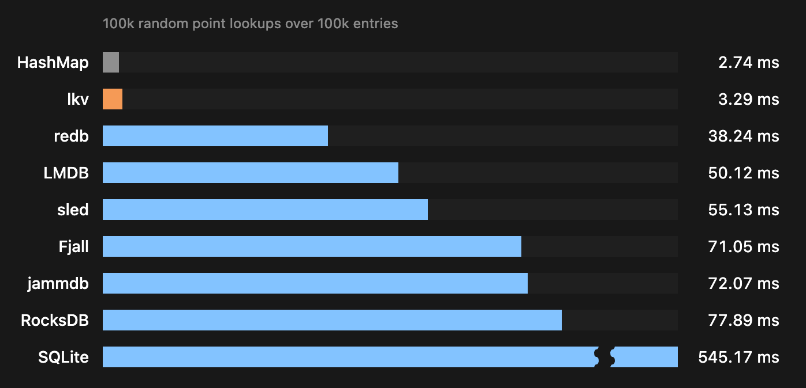

# lkv


[](https://crates.io/crates/lkv)
[](https://docs.rs/lkv)


A lightweight and fast embedded key-value store for Rust.



## 概要

lkvはRust実装の軽量かつ高速な組み込みDBです。ハッシュテーブルをベースとした読み取り性能や省メモリに特化した設計になっており、LMDBやsled、redbなどよりも高速なルックアップを特徴としています。

lkvは構造のシンプルさと読み取り時のパフォーマンスを保つため、非常に少ない機能のみを備えています。以下はlkvがサポートするものです。

- 任意のバイト列`[u8]`をKey/Valueとした書き込み・読み取り
- 順序未定義の高速スキャン
- 高速かつゼロコピーなルックアップ
- トランザクション
- スナップショット
- 明示的なcompaction

一方で、以下のような機能はサポート外です。

- 複数プロセスからの読み書き
- 複数writer
- 範囲付き、プレフィクスなどの高度なクエリ
- 自動compaction

その性能特性から、軽量な設定の永続化やほとんど変更されることのないマスタデータの管理などに向いています。一方、頻繁に更新される汎用的なDBとしての利用は推奨されません。

lkvの設計の大部分はLinkedinの[PalDB](https://github.com/linkedin/paldb)および[Bitcask](http://github.com/basho/bitcask)にインスパイアされています。また、一部のアイデアは[FASTER](https://github.com/microsoft/faster)を参考としています。

詳細は[docs/design.md](docs/design.md)を参照してください。

## インストール

```sh
cargo add lkv
```

## クイックスタート

```rust
use lkv::{Database, Result};

fn main() -> Result<()> {
    let mut db = Database::create("./example.lkv")?;

    let mut write = db.begin_write()?;
    write.put("name", "lkv")?;
    write.commit()?;

    let read = db.begin_read()?;
    assert_eq!(read.get("name")?, Some(b"lkv".as_slice()));
    for item in read.iter()? {
        let (key, value) = item?;
        println!("{} = {}",
            String::from_utf8_lossy(key),
            String::from_utf8_lossy(value));
    }
    drop(read);

    Ok(())
}
```

## スナップショット

lkvでは`WriteTransaction`を用いてDBへの書き込みを行う場合、同時に読み取りを行うことはできません。書き込み中にDBを読み取りたい場合、`snapshot()`でスナップショットを作成し、これを介して読み取ることが可能です。

```rust
let snapshot = db.snapshot()?;
let old_value = snapshot.get("key")?;
for item in snapshot.iter()? {
    let (key, value) = item?;
}
```

## インメモリ

lkvをインメモリデータベースとして利用することも可能です。

```rust
let mut db = Database::memory();
```

APIは通常のデータベースと同一ですが、ファイルを作成せずにメモリ上で動作します。

## ベンチマーク

> ベンチマークはApple M2、24 GB RAMのMacBook Proで計測を行っています。

| DB                | Bulk 100k (ms) | Write 1 (ms) | Write 1k (ms) | Read 100k (ms) | Delete 1 (ms) | Size (MiB) | Size compacted (MiB) |
| ----------------- | -------------: | -----------: | ------------: | -------------: | ------------: | ---------: | -------------------: |
| `std::HashMap`    |          11.48 |          N/A |           N/A |           2.74 |           N/A |        N/A |                  N/A |
| lkv               |          79.94 |         4.70 |          6.43 |           3.29 |          4.94 |      29.17 |                 9.44 |
| redb              |         169.36 |         4.98 |          7.14 |          38.24 |          5.12 |     128.50 |                16.70 |
| LMDB (heed)       |          56.79 |         5.40 |          6.19 |          50.12 |          5.08 |      36.13 |                 9.10 |
| RocksDB           |          65.23 |         5.40 |          6.89 |          77.89 |          5.22 |      10.07 |                10.07 |
| Fjall             |         168.25 |         4.23 |          5.71 |          71.05 |          4.97 |      73.80 |                  N/A |
| sled              |         686.08 |         4.45 |         13.05 |          55.13 |          5.79 |      80.18 |                  N/A |
| SQLite (rusqlite) |          98.80 |         0.34 |          1.35 |         545.17 |          0.43 |      21.39 |                10.51 |
| jammdb            |         132.79 |         5.23 |          9.85 |          72.07 |          5.45 |      64.50 |                  N/A |

## ライセンス

[MIT](LICENSE)
